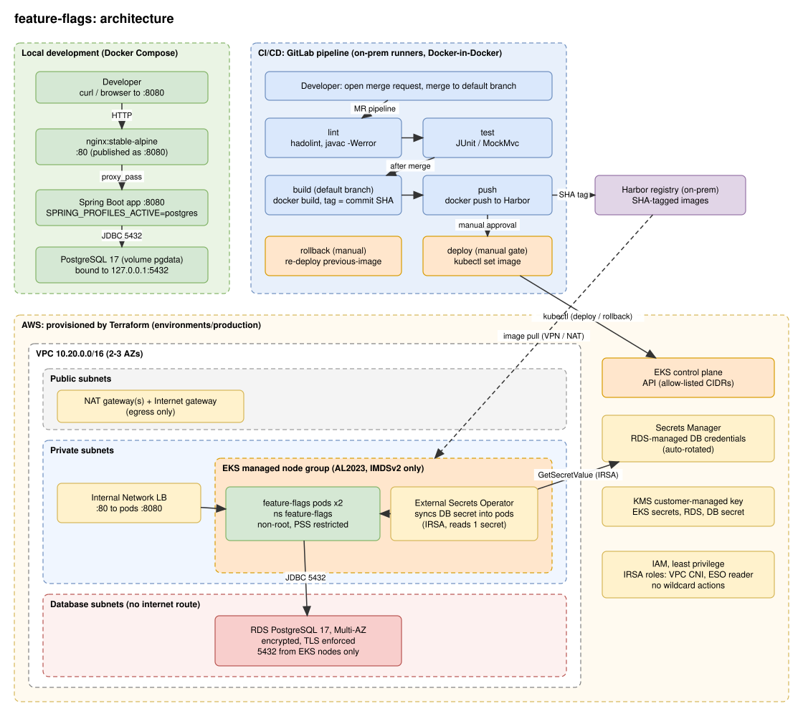

# feature-flags

A small feature-flag service built with Spring Boot 3 (Java 17) and Maven. Flags are created, read
and toggled over a REST API and stored in PostgreSQL (or in memory for quick local runs).

The repository covers the whole path from laptop to production:

| Area | Where | Summary |
|---|---|---|
| Application | `src/` | REST API, in-memory or PostgreSQL storage |
| Container | `Dockerfile`, `compose.yaml`, `nginx/` | Multi-stage non-root image; local stack of nginx, app and Postgres |
| CI/CD | `.gitlab-ci.yml` | Lint, test, build, push to Harbor, manual deploy to Kubernetes, manual rollback |
| Infrastructure | `terraform/` | VPC, EKS, RDS, IAM and Secrets Manager wiring on AWS, split into modules |
| Diagram | `docs/architecture.drawio` | Editable draw.io source of the diagram below |

## Contents

1. [Architecture](#architecture)
2. [API](#api)
3. [Run it locally](#run-it-locally)
4. [CI/CD pipeline](#cicd-pipeline)
5. [Infrastructure](#infrastructure-terraform)
6. [Assumptions](#assumptions)
7. [What we would improve with more time](#what-we-would-improve-with-more-time)

## Architecture



There are three flows to keep in mind:

1. **Request path (production).** An internal client calls the internal Network Load Balancer, which
   forwards to the `feature-flags` pods on port 8080. The pods talk to RDS PostgreSQL over TLS
   (`sslmode=require`). Nothing is exposed to the internet, because the API has no authentication.
2. **Secrets path.** RDS generates and rotates the database password in Secrets Manager (encrypted
   with a customer-managed KMS key). External Secrets Operator, using an IRSA role that can read that
   one secret and use that one key, copies it into a Kubernetes Secret that the pods read as
   environment variables. No password is stored in Terraform code, variables or state.
3. **Delivery path.** A merge to the default branch runs the GitLab pipeline. It builds the image,
   pushes it to the on-prem Harbor registry, and after a manual approval switches the Deployment's
   image with `kubectl set image`. The EKS nodes pull the image from Harbor.

Locally, `docker compose` runs a simplified version of the request path: nginx, the app and Postgres
(the box on the left of the diagram).

## API

| Method | Path            | Description                                   |
|--------|-----------------|-----------------------------------------------|
| GET    | `/flags`        | List all flags                                |
| GET    | `/flags/{name}` | Get one flag (404 if it doesn't exist)        |
| PUT    | `/flags/{name}` | Create or update a flag (201 new, 200 update) |

`PUT` body: `{"enabled": true, "description": "optional"}`. `enabled` is required (400 without it).
If `description` is omitted on an update, the existing one is kept. Names must match
`^[a-z0-9][a-z0-9_-]{0,63}$`: lowercase letters, digits, `-` and `_`, starting with a letter or digit,
up to 64 characters (400 otherwise).

Two flags are seeded on startup: `dark-mode` (off) and `new-checkout` (on).

### Storage

| Spring profile       | Store                | Used for                                 |
|----------------------|----------------------|------------------------------------------|
| none (default)       | In memory            | IDE runs, `mvn test`; resets on restart  |
| `postgres`           | PostgreSQL via JDBC  | Docker Compose and production; persistent, shared state |

The `postgres` profile creates the `flags` table and seeds the two flags on startup
(`src/main/resources/db/schema.sql`, idempotent). Connection settings come from the standard
`SPRING_DATASOURCE_URL`, `SPRING_DATASOURCE_USERNAME` and `SPRING_DATASOURCE_PASSWORD` variables.

## Run it locally

### Option 1: Docker Compose (nginx + app + Postgres)

This is the closest thing to production and needs no Java or Maven installed.

**Prerequisites:** Docker Desktop (Windows/macOS) or Docker Engine (Linux) with Compose v2
(`docker compose version` should work).

**1. Check your settings.** Compose reads `.env` in the project root automatically:

| Variable            | Default | Purpose                                              |
|---------------------|---------|------------------------------------------------------|
| `POSTGRES_PASSWORD` | none    | **Required.** Compose refuses to start without it. Generate one with `openssl rand -hex 16`. Avoid `$` in values (Compose treats it as variable syntax). |
| `POSTGRES_USER`     | none    | Database user. Set in `.env` (`flags`); `compose.yaml` has no default. |
| `POSTGRES_DB`       | none    | Database name. Set in `.env` (`flags`); `compose.yaml` has no default. |
| `HTTP_PORT`         | `8080`  | Host port where nginx is reachable                   |
| `DB_HOST_PORT`      | `5432`  | Host port for Postgres, bound to `127.0.0.1` only    |

> **Heads-up:** `.env` is currently committed to git even though its own header says it is ignored.
> Use throwaway local values only, and see [improvement 1](#what-we-would-improve-with-more-time).

**2. Start the stack.**

```bash
docker compose up --build
```

Compose starts the services in dependency order: `db` (waits for `pg_isready`), then `app` (waits for
`GET /flags` to succeed, which also proves the database connection works; allow about 30 seconds on a
cold start), then `nginx`.

| Service | Image | Reachable at | Notes |
|---|---|---|---|
| `nginx` | `nginx:stable-alpine` | `http://localhost:8080` (`HTTP_PORT`) | Only public entry point; proxies to `app:8080` |
| `app` | built from `Dockerfile` | internal only | Runs with `SPRING_PROFILES_ACTIVE=postgres` |
| `db` | `postgres:17-alpine` | `127.0.0.1:5432` (`DB_HOST_PORT`) | Data in the `pgdata` volume |

**3. Try it.**

```bash
curl localhost:8080/flags
curl localhost:8080/flags/dark-mode
curl -X PUT localhost:8080/flags/dark-mode \
     -H 'Content-Type: application/json' -d '{"enabled": true}'
curl -X PUT localhost:8080/flags/beta-search \
     -H 'Content-Type: application/json' \
     -d '{"enabled": false, "description": "Beta search backend"}'
```

On Windows PowerShell, `curl` is an alias for `Invoke-WebRequest` and the commands above will not
work. Use Git Bash or WSL, or:

```powershell
Invoke-RestMethod http://localhost:8080/flags
Invoke-RestMethod -Method Put -Uri http://localhost:8080/flags/dark-mode `
  -ContentType 'application/json' -Body '{"enabled": true}'
```

**4. Stop it.**

```bash
docker compose down        # stop and remove containers, keep the data
docker compose down -v     # also delete the database volume (fresh start)
```

**Troubleshooting**

- *`POSTGRES_PASSWORD is required`*: set it in `.env`.
- *Port already in use*: change `HTTP_PORT` or `DB_HOST_PORT` in `.env`.
- *Changed the password but the app cannot log in*: Postgres only reads `POSTGRES_PASSWORD` when it
  first creates the volume. Run `docker compose down -v` (deletes the data) or change it in the
  database with `ALTER USER`.
- *`app` never becomes healthy*: `docker compose logs app db`.
- *Use the containerised database from your IDE*: `docker compose up -d db`, then run
  `FeatureFlagApplication` with `SPRING_PROFILES_ACTIVE=postgres` and matching
  `SPRING_DATASOURCE_URL` (`jdbc:postgresql://localhost:5432/flags`), `SPRING_DATASOURCE_USERNAME`
  and `SPRING_DATASOURCE_PASSWORD`.

### Option 2: plain Maven (in-memory, no database)

Requires Java 17+ and Maven 3.9+.

```bash
mvn spring-boot:run          # http://localhost:8080
PORT=9000 mvn spring-boot:run
```

Data lives in memory and resets on every restart. The same `curl` commands apply.

### Tests and packaging

```bash
mvn test                     # unit and MockMvc tests, in-memory store, no database needed
mvn package                  # target/feature-flags-1.0.0.jar
java -jar target/feature-flags-1.0.0.jar
docker build -t feature-flags .   # image only, no compose
```

The image is a two-stage build: Maven builds and splits the jar into layers, then a JRE-only Alpine
image runs it as an unprivileged user with container-aware heap settings. Tests are skipped inside
the image build because the pipeline runs them earlier.

## CI/CD pipeline

Defined in `.gitlab-ci.yml`. Pipelines exist only for **merge requests** and for the **default
branch**; a plain push to a feature branch does nothing until an MR is opened, and an MR never gets a
duplicate branch pipeline.

```
Merge request :  lint ──► test                                   (nothing is built or shipped)
Default branch:  lint ──► test ──► build ──► push ──► deploy (manual approval)
                                                      rollback (manual, any time)
```

| Stage | Job | Runs on | What it does | Fails when |
|---|---|---|---|---|
| `lint` | `lint:dockerfile` | MR, default | Runs hadolint on the `Dockerfile` (best practices, shell checks) | Any warning or error (info-level hints are ignored) |
| `lint` | `lint:java` | MR, default | Compiles with warnings and deprecations treated as errors, which catches removed or deprecated APIs early | Any compiler warning |
| `test` | `test:unit` | MR, default | Runs `mvn test` (in-memory store, no database) and uploads the JUnit report so GitLab shows results in the MR | A test fails |
| `build` | `build:image` | default only | Builds the image in a throw-away Docker-in-Docker daemon with `--pull`, tags it with the short commit SHA, adds OCI labels (full SHA, source URL, build time), and hands it to the next stage as a tarball (kept 2 hours) | The build fails |
| `push` | `push:image` | default only | Loads the tarball, logs in to Harbor with a robot account, pushes `harbor/<project>/feature-flags:<sha>`, logs out. There is deliberately no `latest` tag | The push fails |
| `deploy` | `deploy:production` | default, **manual** | Records the running image on the Deployment as the `previous-image` annotation, runs `kubectl set image`, then waits up to 5 minutes for `kubectl rollout status` | New pods are not ready in time (readiness probe) or the 15-minute job timeout is hit |
| `rollback` | `rollback:production` | default, **manual**, optional | Reads the `previous-image` annotation, sets it as the running image and waits for the rollout. Does nothing if already on it; errors if no previous image is recorded | The rollout fails |

Design choices worth knowing:

- **Build and push are separate stages** so a vulnerability scan or signing job can be inserted
  between them and nothing reaches Harbor unless it passes.
- **Manual gate.** `deploy:production` is `when: manual` with `allow_failure: false`, so the
  pipeline shows as blocked until someone presses Play. Who may press it is controlled in GitLab
  (protected environment `production`), not in the file.
- **One deployment at a time.** Both production jobs share `resource_group: production`.
- **Rollback needs no GitLab API token.** It works from the annotation on the Deployment, and it can
  start immediately (`needs: []`) from any default-branch pipeline, even one that never deployed.
  It uses the environment action `access`, so GitLab does not record the current commit as live.
- **Speed.** Maven dependencies are cached per `pom.xml` hash, and a newer push to the same MR cancels
  the older run (`interruptible`).

### One-time setup

Create these under **Settings > CI/CD > Variables** (never in the file):

| Variable | Purpose | Flags |
|---|---|---|
| `HARBOR_USERNAME` | Harbor robot account with push rights on one project (robot names contain `$`: untick "Expand variable reference") | protected |
| `HARBOR_PASSWORD` | The robot account secret | masked, protected |
| `K8S_TOKEN` | ServiceAccount token of `ci-deployer` (may only get/list/watch/patch Deployments in one namespace) | masked, protected, scope `production` |
| `K8S_CA_FILE` | Cluster CA certificate (type File) | protected, scope `production` |

Also:

- Replace the placeholders at the top of the file: `HARBOR_REGISTRY`, `HARBOR_PROJECT`,
  `PROXY_CACHE`, `K8S_API_URL` (use the EKS endpoint from `terraform output cluster_endpoint`) and
  `PROD_URL`.
- Mark the default branch **protected**, otherwise protected variables are not exposed to it.
- Restrict **Protected environments > production** to the release group.
- In Harbor, enable **tag immutability** and a **retention rule** that keeps enough recent tags,
  because rollback needs the previous image to still exist.
- Runners must support privileged Docker-in-Docker and reach Harbor and the Kubernetes API.
- The pipeline expects the Deployment to exist already. Bootstrap it once with the manifests in
  `terraform/environments/production/k8s/` (see [`terraform/README.md`](terraform/README.md)).

## Infrastructure (Terraform)

`terraform/` builds the production environment on AWS. Run it from `terraform/environments/production`;
it composes the reusable modules in `terraform/modules/`:

| Module | Creates |
|---|---|
| `network` | VPC with public, private and isolated database subnets across 2-3 AZs, NAT, routing |
| `kms` | Customer-managed key for EKS secrets, RDS storage and the DB credentials secret |
| `eks` | EKS cluster, managed node group, add-ons, OIDC/IRSA, cluster/node/CNI roles |
| `rds` | PostgreSQL 17, private and encrypted, RDS-managed password in Secrets Manager |
| `app` | Namespace, service accounts, ConfigMap, CI deployer RBAC, External Secrets and its IAM role |

See [`terraform/README.md`](terraform/README.md) for how each requirement is met, apply steps and
caveats.

## Assumptions

**Platform and delivery**

- Production is Kubernetes on **AWS EKS**, created by the Terraform in this repo, and runs **one
  Deployment with one container** named `app` in the `feature-flags` namespace. The pipeline deploys
  by changing the image on that existing Deployment (`kubectl set image`); it does not apply manifests.
- Images live in an **on-prem Harbor** registry. The EKS nodes can reach it (VPN or Direct Connect) and
  pull with an image pull secret named `harbor-pull`, which is created outside Terraform.
- The Git remote is on GitHub but the pipeline is **GitLab CI**, so we assume the project is mirrored
  to, or moved into, GitLab. GitLab runners are on-prem, allowed to run privileged Docker-in-Docker,
  and can reach both Harbor and the EKS API endpoint (allow-listed by `cluster_public_access_cidrs`).
- There is a **single environment** (production). There is no staging, and the pipeline does not run
  Terraform.
- The values in `.gitlab-ci.yml` (`harbor.example.internal`, `my-project`, `K8S_API_URL`, `PROD_URL`)
  are placeholders. The default region (`eu-west-1`), Kubernetes version (1.34) and External Secrets
  chart version (1.0.0) in Terraform were chosen from memory and should be checked.
- The Terraform has been syntax-checked and cross-checked but **not yet run** with
  `terraform validate`, `plan` or `apply`.

**Application and data**

- The data set is small (one `flags` table), so a single PostgreSQL instance with a schema applied on
  startup (`spring.sql.init.mode=always`, idempotent SQL) is enough; there is no migration tool.
- The database is PostgreSQL 17 everywhere, matching `postgres:17-alpine` in Compose.
- The app connects as the RDS **master user**, and JDBC uses `sslmode=require` (encrypted, but the
  server certificate is not verified).
- The API has **no authentication**, so in production it is reachable only through an internal load
  balancer, and it is assumed to sit behind other controls (VPN, private network).
- Health checks use `GET /flags` because it exercises the database; there is no Actuator.

**Security**

- Secrets are never written in code: production credentials come from Secrets Manager, CI credentials
  from protected and masked GitLab variables, and local credentials from `.env`.
- IAM policies written here use explicit actions and resource ARNs. The EKS cluster, node and CNI
  roles use the AWS-managed policies AWS defines for those roles.

## What we would improve with more time

Roughly in priority order.

**Security**

1. **Stop tracking `.env`.** It is committed although its header (and the previous README) say it is
   ignored, and `.env.example` does not exist. Run `git rm --cached .env`, add `.env` to `.gitignore`,
   commit a `.env.example` with placeholders, and treat the current `POSTGRES_PASSWORD` as exposed:
   rotate it, and purge history if the repository is shared. Also make `.dockerignore` list `.env`
   and the real compose file name (`compose.yaml`); it is harmless today only because the Dockerfile
   copies just `pom.xml` and `src`.
2. **Security gates between build and push:** container image scan (for example Trivy), dependency and
   SAST scanning, secret detection, an SBOM, and image signing with an admission check that only
   signed images run.
3. **Replace the long-lived `K8S_TOKEN`** with the GitLab Agent for Kubernetes or short-lived OIDC
   credentials.
4. **Least privilege in the database:** a dedicated DML-only application user instead of the master
   user, `sslmode=verify-full` with the RDS CA bundle in the image, and pod restarts (for example
   Stakater Reloader) so pods pick up rotated credentials.
5. **Authentication and authorization on `PUT /flags/*`**, then TLS at the edge (ALB or ingress with a
   certificate) before any internet exposure.

**Delivery**

6. **Terraform in CI:** `fmt`, `validate`, `tflint`/`checkov` and `plan` on merge requests, a manual
   `apply`, and remote state with locking. First step: run `terraform validate` and `plan` for real.
7. **GitOps or packaged manifests** (Argo CD/Flux with Helm or Kustomize) instead of `kubectl set
   image`, so the full desired state is versioned and drift is visible.
8. **Staging environment, post-deploy smoke test and automatic rollback** when the smoke test or
   rollout fails; later, canary or blue/green releases.
9. **Real integration tests.** CI only runs tests against the in-memory store, so `JdbcFlagService`
   and `schema.sql` are never tested. Add Testcontainers with PostgreSQL 17.
10. **Database migrations** with Flyway or Liquibase instead of a schema script run on every startup.

**Reliability and operations**

11. **Observability:** Actuator with separate liveness and readiness probes, Micrometer/Prometheus
    metrics, structured logs, dashboards and alerts.
12. **Kubernetes hardening and scaling:** NetworkPolicies, a PodDisruptionBudget, a
    HorizontalPodAutoscaler, node autoscaling (Karpenter or Cluster Autoscaler), and right-sized
    resource requests from real load data.
13. **Cost and networking:** VPC endpoints for Secrets Manager, S3 and ECR to reduce NAT traffic, and a
    cheaper single-NAT option for non-production environments.
14. **Harbor and build hygiene:** enforce tag immutability and retention as code, and add a Maven
    mirror (Nexus or Artifactory) for on-prem runners.
